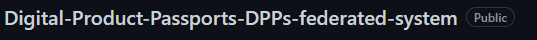

<!-- Improved compatibility of back to top link: See: https://github.com/othneildrew/Best-README-Template/pull/73 -->
<a name="readme-top"></a>
<!--
*** Thanks for checking out the Best-README-Template. If you have a suggestion
*** that would make this better, please fork the repo and create a pull request
*** or simply open an issue with the tag "enhancement".
*** Don't forget to give the project a star!
*** Thanks again! Now go create something AMAZING! :D
-->


<!-- PROJECT SHIELDS -->
<!--
*** I'm using markdown "reference style" links for readability.
*** Reference links are enclosed in brackets [ ] instead of parentheses ( ).
*** See the bottom of this document for the declaration of the reference variables
*** for contributors-url, forks-url, etc. This is an optional, concise syntax you may use.
*** https://www.markdownguide.org/basic-syntax/#reference-style-links
-->
[![Contributors][contributors-shield]][contributors-url]
[![Forks][forks-shield]][forks-url]
[![Stargazers][stars-shield]][stars-url]
[![Issues][issues-shield]][issues-url]
[![MIT License][license-shield]][license-url]
[![LinkedIn][linkedin-shield]][linkedin-url]


<!-- PROJECT LOGO -->
<br />
<div align="center">
  <a href="https://github.com/elliot-eriksson/Digital-Product-Passports-DPPs-federated-system">
    
  </a>

<h3 align="center">Digital Product Passports DPPs federated system</h3>

  <p align="center">
    project_description
    <br />
    <a href="https://github.com/elliot-eriksson/Digital-Product-Passports-DPPs-federated-system"><strong>Explore the docs »</strong></a>
    <br />
    <br />
    <a href="https://github.com/elliot-eriksson/Digital-Product-Passports-DPPs-federated-system">View Demo</a>
    ·
    <a href="https://github.com/elliot-eriksson/Digital-Product-Passports-DPPs-federated-system/issues">Report Bug</a>
    ·
    <a href="https://github.com/elliot-eriksson/Digital-Product-Passports-DPPs-federated-system/issues">Request Feature</a>
  </p>
</div>

<p><a href="API documentation.pdf">API documentation </a></p>


<!-- TABLE OF CONTENTS -->
<details>
  <summary>Table of Contents</summary>
  <ol>
    <li>
      <a href="#about-the-project">About The Project</a>
      <ul>
        <li><a href="#built-with">Built With</a></li>
      </ul>
    </li>
    <li>
      <a href="#getting-started">Getting Started</a>
      <ul>
        <li><a href="#prerequisites">Prerequisites</a></li>
        <li><a href="#installation">Installation</a></li>
      </ul>
    </li>
    <li><a href="#usage">Usage</a></li>
    <li><a href="#roadmap">Roadmap</a></li>
    <li><a href="#contributing">Contributing</a></li>
    <li><a href="#license">License</a></li>
    <li><a href="#contact">Contact</a></li>
    <li><a href="#acknowledgments">Acknowledgments</a></li>
  </ol>
</details>


<!-- ABOUT THE PROJECT -->
## About The Project

[![Product Name Screen Shot][product-screenshot]](https://example.com)

Here's a blank template to get started: To avoid retyping too much info. Do a search and replace with your text editor for the following: `elliot-eriksson`, `Digital-Product-Passports-DPPs-federated-system`, `twitter_handle`, `linkedin_username`, `email_client`, `email`, `Digital-Product-Passports-DPPs-federated-system`, `project_description`

<p align="right">(<a href="#readme-top">back to top</a>)</p>


### Built With

* [![Go][Go.js]][Go-url]
* [![IPFS][ipfs.js]][ipfs-url]


<p align="right">(<a href="#readme-top">back to top</a>)</p>


<!-- GETTING STARTED -->
## Getting Started

This is an example of how you may give instructions on setting up your project locally.
To get a local copy up and running follow these simple example steps.

### Prerequisites
[![postman][postman.js]][postman-url]

This is an example of how to list things you need to use the software and how to install them.

Follow the instructions at [IPFS kubo](https://docs.ipfs.tech/install/command-line/#install-official-binary-distributions) for windows for mac check below.


* macOS
  ```sh
  brew install ipfs
  ```  

* Confirm your installation
  ```sh
  ipfs --version
  ```  

Postman or another similar application can be used to connect to the API endpoints,
installation at [Postman](https://www.postman.com/downloads/).


### Installation


1. Clone the repo
   ```sh
   git clone https://github.com/elliot-eriksson/Digital-Product-Passports-DPPs-federated-system.git
   ```
2. Get requirements
   ```sh
    go mod init example.com/greetings
    $ go: creating new go.mod: module example.com/greetings
    
    go mod tidy

   ```
3. Make sure you are in the right API subfolder, run the program
   ```go
    go run .
   ```


### Installation API


For installing on AWS EC2 client follow [AWS installation guide.](https://docs.aws.amazon.com/AWSEC2/latest/UserGuide/get-set-up-for-amazon-ec2.html) 


The following security inbound in required for yo to be able to connect to the API.
```sh
IPv4	HTTP	    TCP	80      0.0.0.0/0	
IPv4	SSH	        TCP	22	    0.0.0.0/0	
IPv4	Custom TCP	TCP	8081    0.0.0.0/0	
IPv4	HTTPS	    TCP	443     0.0.0.0/0	
```
After this is done you can start your instance.

The following commands is needed to setup the server for the API on AWS EC2 instance.

Enter super user
```sh
sudo su -l 
```
Update and install the webserver
```sh
yum update -y  
yum install -y httpd 
```


For the latest installation of Kubo IPFS for linux follow the link below
[installation guide.](https://docs.ipfs.tech/install/command-line/#install-official-binary-distributions)

Installation of golang, you will need to enter the bash file and add the export line somewhere in the document for the path to work after a restart of the server.
```sh
yum install golang-go  
vi ~/.bashrc 
export PATH=$PATH:/usr/local/go/bin
```

```sh
cd var/www/html 
wget "current zip for the project" 
unzip the project
enter the folder
```

When first entering the file ther will be some not up to date files remove them and fetch the new once
```sh
rm go.mod 
rm go.sum
go mod init go.mod
go mod tidy 
```

Enter the API folder and initiate the ipfs daemon.
```sh
cd API
ipfs init 
```
To start the IPFS daemon and the API
```sh
ipfs daemon &
go run .
```

Important note! when restarting or shuting the tab for the webserver you will need to enter super user and manouver to /var/www/html before you can rerun the startup commands. If the dameon or the server is complaining about the locks you can enter ```ps -A``` and ```kill pid``` the jobs for ipfs and API


<p align="right">(<a href="#readme-top">back to top</a>)</p>


<!-- USAGE EXAMPLES -->
## Usage

Use this space to show useful examples of how a project can be used. Additional screenshots, code examples and demos work well in this space. You may also link to more resources.

_For more examples, please refer to the [Documentation](https://example.com)_

<p align="right">(<a href="#readme-top">back to top</a>)</p>


<!-- ROADMAP -->
## Roadmap

- [ ] Feature 1
- [ ] Feature 2
- [ ] Feature 3
    - [ ] Nested Feature

See the [open issues](https://github.com/elliot-eriksson/Digital-Product-Passports-DPPs-federated-system/issues) for a full list of proposed features (and known issues).

<p align="right">(<a href="#readme-top">back to top</a>)</p>


<!-- CONTRIBUTING -->
## Contributing

Contributions are what make the open source community such an amazing place to learn, inspire, and create. Any contributions you make are **greatly appreciated**.

If you have a suggestion that would make this better, please fork the repo and create a pull request. You can also simply open an issue with the tag "enhancement".
Don't forget to give the project a star! Thanks again!

1. Fork the Project
2. Create your Feature Branch (`git checkout -b feature/AmazingFeature`)
3. Commit your Changes (`git commit -m 'Add some AmazingFeature'`)
4. Push to the Branch (`git push origin feature/AmazingFeature`)
5. Open a Pull Request

<p align="right">(<a href="#readme-top">back to top</a>)</p>


<!-- LICENSE -->
## License

Distributed under the MIT License. See `LICENSE.txt` for more information.

<p align="right">(<a href="#readme-top">back to top</a>)</p>


<!-- CONTACT -->
## Contact

Elliot Eriksson - elliot.eriksson@outlook.com

Project Link: [https://github.com/elliot-eriksson/Digital-Product-Passports-DPPs-federated-system](https://github.com/elliot-eriksson/Digital-Product-Passports-DPPs-federated-system)

<p align="right">(<a href="#readme-top">back to top</a>)</p>


<!-- ACKNOWLEDGMENTS -->
## Acknowledgments

* []()
* []()
* []()

<p align="right">(<a href="#readme-top">back to top</a>)</p>


<!-- MARKDOWN LINKS & IMAGES -->
<!-- https://www.markdownguide.org/basic-syntax/#reference-style-links -->
[contributors-shield]: https://img.shields.io/github/contributors/elliot-eriksson/Digital-Product-Passports-DPPs-federated-system.svg?style=for-the-badge
[contributors-url]: https://github.com/elliot-eriksson/Digital-Product-Passports-DPPs-federated-system/graphs/contributors
[forks-shield]: https://img.shields.io/github/forks/elliot-eriksson/Digital-Product-Passports-DPPs-federated-system.svg?style=for-the-badge
[forks-url]: https://github.com/elliot-eriksson/Digital-Product-Passports-DPPs-federated-system/network/members
[stars-shield]: https://img.shields.io/github/stars/elliot-eriksson/Digital-Product-Passports-DPPs-federated-system.svg?style=for-the-badge
[stars-url]: https://github.com/elliot-eriksson/Digital-Product-Passports-DPPs-federated-system/stargazers
[issues-shield]: https://img.shields.io/github/issues/elliot-eriksson/Digital-Product-Passports-DPPs-federated-system.svg?style=for-the-badge
[issues-url]: https://github.com/elliot-eriksson/Digital-Product-Passports-DPPs-federated-system/issues
[license-shield]: https://img.shields.io/github/license/elliot-eriksson/Digital-Product-Passports-DPPs-federated-system.svg?style=for-the-badge
[license-url]: https://github.com/elliot-eriksson/Digital-Product-Passports-DPPs-federated-system/blob/master/LICENSE.txt
[linkedin-shield]: https://img.shields.io/badge/-LinkedIn-black.svg?style=for-the-badge&logo=linkedin&colorB=555
[linkedin-url]: https://linkedin.com/in/linkedin_username
[product-screenshot]: images/screenshot.png
[Next.js]: https://img.shields.io/badge/next.js-000000?style=for-the-badge&logo=nextdotjs&logoColor=white
[Next-url]: https://golang.org/
[Go-url]: https://golang.org/
[Go.js]: https://img.shields.io/badge/Go-00ADD8?style=for-the-badge&logo=go&logoColor=white
[postman-url]: https://golang.org/
[postman.js]: https://img.shields.io/static/v1?style=for-the-badge&message=Postman&color=FF6C37&logo=Postman&logoColor=FFFFFF&label=
[ipfs-url]: http://ipfs.io/
[ipfs.js]: https://img.shields.io/badge/project-IPFS-blue.svg?style=flat-square
